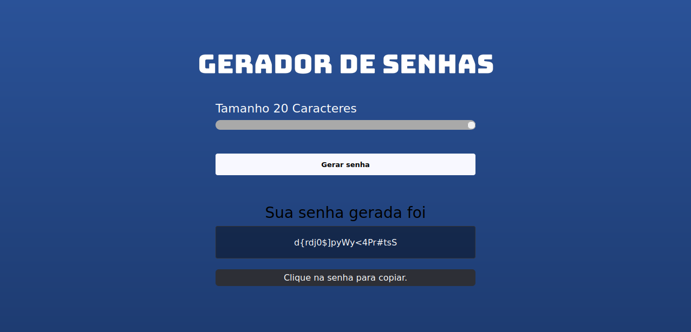

<h1 align="center"> gerador-de-senha </h1>

  <a href="#-tecnologias">Tecnologias</a>&nbsp;&nbsp;&nbsp;|&nbsp;&nbsp;&nbsp;
  <a href="#-projeto">Projeto</a>&nbsp;&nbsp;&nbsp;|&nbsp;&nbsp;&nbsp;
  <a href="#memo-licença">Licença</a>

  

 

<h1>Desktop:</h1>
  

## 🚀 Tecnologias

Esse projeto foi desenvolvido com as seguintes tecnologias:

- HTML e CSS
- JavaScript

## 💻 Projeto

O projeto gerador de senhas foi desenvolvido com base na vídeo aula do canal Sujeito programador. Ele funciona gerando senha aleatorias que podemos escolher a quantidade delas de 5 até 20 caracteres para a senha e quando geradas nos mostra a senha que foi gerada e a opção para copiar a mesma.

## :memo: Licença

Esse projeto está sob a licença MIT.

---
